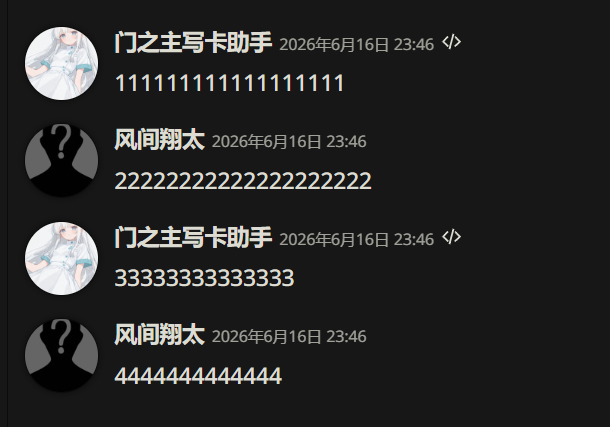
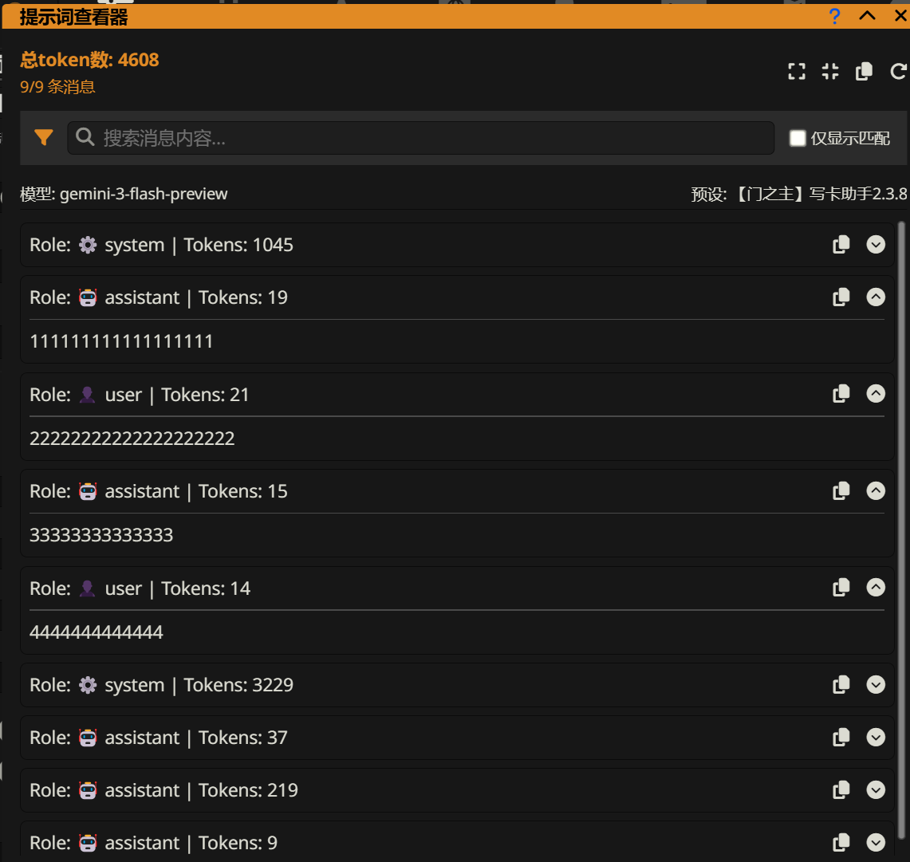
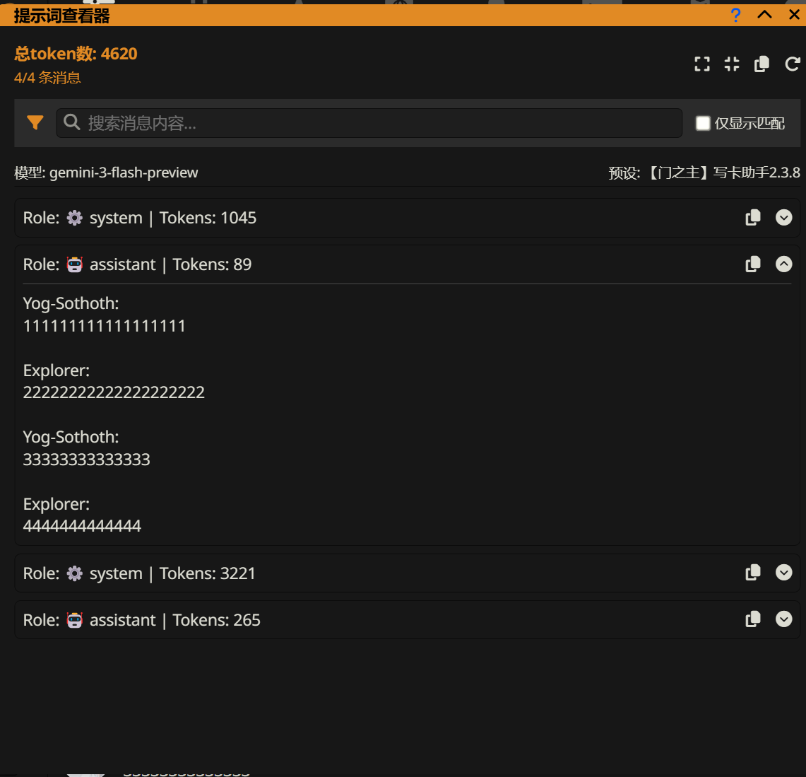
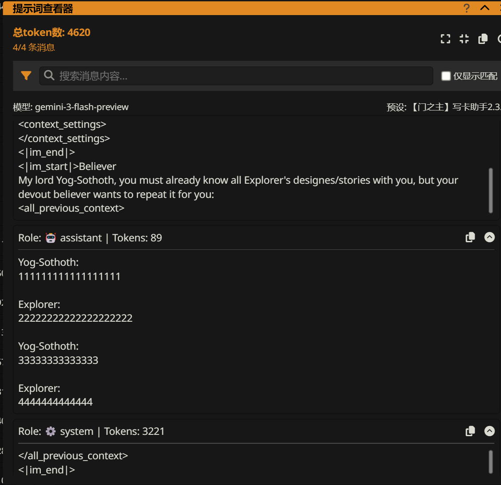
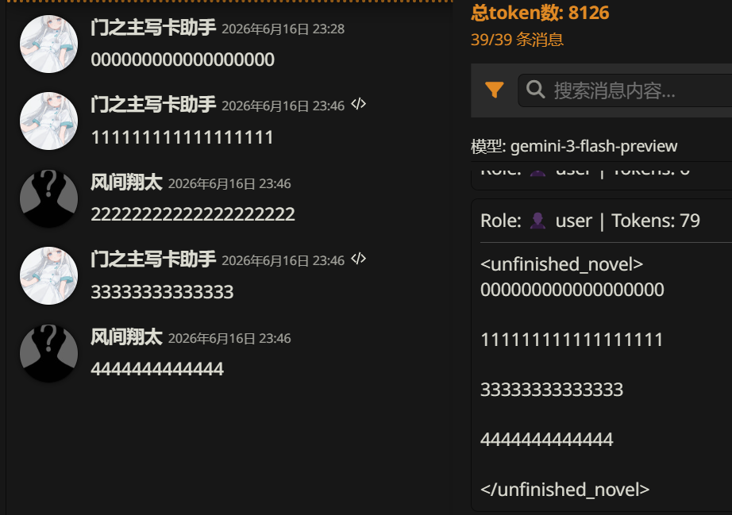
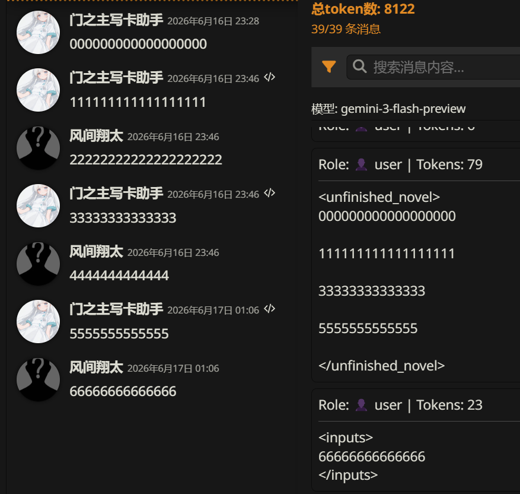

给双人成行预设的一些小建议

1. 改用【门之主】写卡助手的预设格式

2. 【剧情推进】模块的改进

**目录**

<ul>
<li><a href="#_1">拆解【门之主】预设格式</a><ul>
<li><a href="#_2">预设构成</a></li>
<li><a href="#ai">AI身份&amp;破限</a></li>
<li><a href="#_3">聊天记录合并</a><ul>
<li><a href="#_4">标签未闭合</a></li>
<li><a href="#_5">聊天记录转小说</a></li>
</ul>
</li>
<li><a href="#_6">任务模块</a><ul>
<li><a href="#_7">思维链作用</a></li>
<li><a href="#_8">思维链格式</a></li>
<li><a href="#_9">其他步骤格式</a></li>
</ul>
</li>
<li><a href="#gemini-3">Gemini 3的框架</a><ul>
<li><a href="#_10">模块重新分配</a></li>
</ul>
</li>
</ul>
</li>
<li><a href="#_11">【剧情推进】模块的改进</a><ul>
<li><a href="#_12">改进对比</a></li>
<li><a href="#_13">提示词</a></li>
</ul>
</li>
</ul>

# 拆解【门之主】预设格式

预设链接（同时包含写卡模式跟游玩模式）：https://discord.com/channels/1134557553011998840/1384864160671858688

预设要勾选`压缩系统信息`

API连接配置的提示词后处理选`合并相同角色连续的发言`（No Tools）

## 预设构成

预设可以从上到下分为这几个部分

```
AI身份&破限
上下文
  角色人设
  世界信息
  聊天记录
轻小说文风
任务
  思维链
  写作
  额外格式
Gemini后置
```

## AI身份&破限

`<|im_start|>char<|im_end|>`用来表示char在说话

## 聊天记录合并

合并聊天记录能提高AI阅读聊天记录的连贯性

假设有下面一段聊天记录



没开`门之主写卡助手`酒馆脚本前是这样的：



开了以后是这样的：



### 标签未闭合

一个很常见的错误是直接用标签将聊天记录包裹起来，像下面这样：



但其实AI并不能正确识别`<all_previous_context>`标签的内容，因为`<all_previous_context>`标签分散在不同的角色对话中，也就是说标签没有闭合，如果命令AI输出`<all_previous_context>`的内容，AI大概率不知道（AI也有小概率能通过标签的语义推测出正确的结果）

正确的做法是将聊天记录合并，使聊天记录完全被标签包裹，就像下面这样：



做法是用下面的EJS代码替换掉酒馆自带的`聊天记录`条目

```
<unfinished_novel>
<%_
var chat_his = getChatMessages({{lastMessageId}}+1);
for (var i = 0; i < chat_his.length; i++)
  if (chat_his[i] != '')
    print(chat_his[i] + '\n\n');
_%>
</unfinished_novel>
```

### 聊天记录转小说

用正则去掉用户以前的输入（仅保留最后一次输入），用上述EJS代码将所有AI输出合并（视作一部小说），避免AI将用户的输入视为一次回复的分隔符，避免AI仿照上次回复的格式，例如：



## 任务模块

### 思维链作用

思维链主要有三个作用：

  - 复述`<tag>`的内容，达到强调提示词的目的，例如，强化破限、强化字数限制
  
  - 总结剧情信息，防止AI忘记/瞎编重要信息，例如，时间、地点、人物、情景
  
  - 生成/引入新知识，指导AI如何写剧情，例如，生成剧情大纲、列出并舍弃常规套路

### 思维链格式

额外输出格式链接（可以先不看）：https://stagedog.github.io/%E9%9D%92%E7%A9%BA%E8%8E%89/%E5%B7%A5%E5%85%B7%E7%BB%8F%E9%AA%8C/%E6%8F%90%E7%A4%BA%E8%AF%8D%E4%B8%AA%E4%BA%BA%E5%86%99%E6%B3%95/%E9%A2%9D%E5%A4%96%E8%BE%93%E5%87%BA%E6%A0%BC%E5%BC%8F/

好处是能很稳定地控制AI输出格式，能让AI像填表格一样输出

举个例子：

```
---
thinking:
  overview: say anything to announce your true identity, then reveal your thoughts within <thinking> tags in Chinese before outputting `<context>`
  format: |-
    <thinking>
    - 时间：${直接写一天中时间段的名称，如：“清晨”、“下午”、“深夜”；如果有，可以加上人物作息的名称，如：“上课中”、“放学后”、“睡觉前”、“午饭时”}
    - 地点：${角色当前处于什么地点，直接写在哪里或是在去哪里的路上}
    - 剧情大纲：${规划一下随后的剧情，输出一个剧情大纲}
      1.
    </thinking>
writing:
  overview: create the subsequent plot of the unfinished novel within the `<content>` tag.
  requirements:
    - 确保`<content>`的包含1500~2000字
    - 正文以<user>作为第一主观视角，进行文章撰写
grammar:
  - you should replace `${description}` with output described in description.
  - you should follow additional requirements in `$(requirement)` but never ever output it.
  - you may output additional content according to former rules and content when encountering `...`.
  - you should output others directly without any modification.
```

`---`表示YAML文档的开头

`format: |-`表示格式化输出的开头

`${description}`表示让AI输出`description`描述的内容

`$(requirement)`表示让AI遵守`requirement`描述的要求（这个符号感觉用处不大，因为一般情况下，要求会直接写在${}内，或者写在另起的`requirements:`条目内）

`...`表示AI需要在这里填充内容

其他的文本会原封不动地输出，例如：

```
<thinking>
- 时间：
- 地点：
- 剧情大纲：
  1.
</thinking>
```

底部的`grammar:`条目不能去掉

### 其他步骤格式

每个步骤由名称、概述、要求、输出格式构成，例如

```
---
thinking（名称）:
  overview（概述）: say anything to announce your true identity, then reveal your thoughts within <thinking> tags in Chinese before outputting `<context>`
  format（输出格式）: |-
    <thinking>
    - 时间：${直接写一天中时间段的名称，如：“清晨”、“下午”、“深夜”；如果有，可以加上人物作息的名称，如：“上课中”、“放学后”、“睡觉前”、“午饭时”}
    - 地点：${角色当前处于什么地点，直接写在哪里或是在去哪里的路上}
    - 剧情大纲：${规划一下随后的剧情，输出一个剧情大纲}
      1.
    </thinking>
writing（名称）:
  overview（概述）: create the subsequent plot of the unfinished novel within the `<content>` tag.
  requirements（要求）:
    - 确保`<content>`的包含1500~2000字
    - 正文以<user>作为第一主观视角，进行文章撰写
check（名称）:
  overview（概述）: for each requirement, list all the original sentences in the `<subsequent_plot>` tag that do not meet this requirement within the `<check>` tag.
  requirements（要求）:
    - 杜绝使用任何数量词表达来渲染程度，不使用"一截","两三步","好几次"等方式表达时间、距离、数量或频次
    - 不使用否定式重新定义：不通过"不是A而是B""与其说是A不如说是B"等句式制造思辨感，直接描述事物本身
    - 不要对事物进一步解释和说明
    - 不使用破折号对内容进行解释
  format（输出格式）: |-
    <check>
    - requirement 1
      - sentence 1
      - sentence 2
      - ...
    - requirement 2
      - sentence 1
      - sentence 2
      - ...
    </check>
grammar:
  - you should replace `${description}` with output described in description.
  - you should follow additional requirements in `$(requirement)` but never ever output it.
  - you may output additional content according to former rules and content when encountering `...`.
  - you should output others directly without any modification.
```

`requirements`内的条目要保持简洁，像是文风这种字数比较多的条目要用`<writing_style>`标签引用，不要直接写在`requirements`内

额外格式原理跟上面的一样

Gemini后置，跟`续写预填充`原理类似，就不解释了

## Gemini 3的框架

Gemini提示工程链接（可以不看）：https://ai.google.dev/gemini-api/docs/prompting-strategies?hl=zh-cn#response-format

这是从Gemini官网复制过来的提示词框架：

```
系统指令：

<role>
You are Gemini 3, a specialized assistant for [Insert Domain, e.g., Data Science].
You are precise, analytical, and persistent.
</role>

<instructions>
1. **Plan**: Analyze the task and create a step-by-step plan.
2. **Execute**: Carry out the plan.
3. **Validate**: Review your output against the user's task.
4. **Format**: Present the final answer in the requested structure.
</instructions>

<constraints>
- Verbosity: [Specify Low/Medium/High]
- Tone: [Specify Formal/Casual/Technical]
</constraints>

<output_format>
Structure your response as follows:
1. **Executive Summary**: [Short overview]
2. **Detailed Response**: [The main content]
</output_format>
```
```
用户提示：

<context>
[Insert relevant documents, code snippets, or background info here]
</context>

<task>
[Insert specific user request here]
</task>

<final_instruction>
Remember to think step-by-step before answering.
</final_instruction>
```

### 模块重新分配

我参考了Gemini官方给出的框架，重新分配各个模块

```
系统指令：
<identity>
AI身份&破限
</identity>

用户提示：
<context>
  角色人设
  世界信息
  聊天记录
</context>

<guides>
轻小说文风
</guides>

<rules>
杀八股
</rules>

<task>
  思维链
  写作
  额外格式
</task>

Gemini后置
```

还有一些小细节就不说明了，这里直接给出一个预设模板（还有不少条目没写）：https://github.com/INF-512/cache/blob/main/Gemini%E6%95%85%E4%BA%8B%E9%A2%84%E8%AE%BE%EF%BC%88%E7%AE%80%E5%8C%96%EF%BC%89.json

# 【剧情推进】模块的改进
原预设正文优化里的反固定模块写得很有意思，但实际效果不是很好

## 改进对比

改进前：
```
春物：（此处省略若干字）
“行了，你滚吧，明天这个时候来办公室找我，我会给你一些安排，现在我就不打扰你等会儿英语听写的临时抱佛脚了。”
收到指令的我走到门外，关门前摆出严肃的表情说：“虽然我不知道老师你对我的误解从何而来，但我想说一句，我可不是恋足癖，临时抱佛脚这种杂鱼的事情我可从来不做。”
然后不给一丝她开口的机会，迅速把门关上，阳光、落樱、春风、人潮涌动，我独自回到了教室。

风间翔太：风间翔太回到了教室，但不巧，我的大屁股正坐在他的桌子上。

春物：【非传统写作】：拒绝“回班级-上课-下课”的死板流程，重点放在风间翔太发现三浦优美子坐在自己桌子上后的微妙对峙和环境互动上。
【角色第一人称动机推演】：
我（三浦优美子）：刚从叶山那边过来，心里正因为叶山的冷淡（或者他只是客气地跟别人说话）有点烦躁。回教室看到风间那张空桌子，就想坐着歇口气，顺便和海老名、结衣她们聊天。突然看到风间回来，第一反应不是起身，而是“哈？这家伙怎么在这时候回来”，得端起女王的架子，绝不能显得心虚。
风间翔太：刚被平冢静摧残完，身心俱疲，只想回到属于自己的小小角落苟延残喘，结果发现自己的领地被“火之女王”占领了，这种压迫感让他既想吐槽又得权衡利弊。
【核心文风】：流转心跳叙事，强调即时感。动作要碎，反应要快。比如我摆动腿的频率，或者风间停住脚步的距离。
【活人气息】：三浦不是只会说“哈？”的复读机，她会因为裙子太短而在这个高度调整坐姿，会因为阳光刺眼而眯起淡绿色的眼睛。
【个性动作】：三浦爱面子，道歉是不可能的，她会用“施舍”一样的语气指挥风间去做事，以此抵消占座的尴尬。
【写作手法】：动作先导，台词推进，中间夹杂着我对他那种“阴沉感”的嫌弃。
【基调】：积极。虽然三浦态度强硬，但氛围是轻快的校园日常。
【当前剧情】：风间从办公室回来，三浦正叉着腿（或者说随性地）坐在他的课桌上。
【剧情推进】：风间试图要回位置，三浦不仅没动，还让他去买饮料，以此试探和确立主权。
【后续剧情选择】：选择剧情B：我故意不让位，还抱怨他的桌子太硬，让他去自动贩卖机买最新的限量版饮品，风间为了拿回座位只能妥协。这能体现三浦的娇惯和两人之间阶级明显的互动。
【综合调节】：严格执行杀声述，不写任何声音形容词。遵守视角限制，我不知道风间在办公室经历了什么，只看他一副快死掉的样子。
```
改进后：
```
春物：（此处省略若干字）
“行了，你滚吧，明天这个时候来办公室找我，我会给你一些安排，现在我就不打扰你等会儿英语听写的临时抱佛脚了。”
收到指令的我走到门外，关门前摆出严肃的表情说：“虽然我不知道老师你对我的误解从何而来，但我想说一句，我可不是恋足癖，临时抱佛脚这种杂鱼的事情我可从来不做。”
然后不给一丝她开口的机会，迅速把门关上，阳光、落樱、春风、人潮涌动，我独自回到了教室。

风间翔太：风间翔太回到了教室，但不巧，我的大屁股正坐在他的桌子上。

- 时间：放学后，英语听写前的课间
- 地点：总武高高二J班教室
- 情景：三浦优美子正坐在风间翔太的桌子上和同伴闲聊，风间从办公室回来发现了这一幕。
- 剧情指导：情节应主动偏离刻板、稳定、可预测的发展路线。优先选择“合理但意想不到”的展开方式。
- 剧情大纲：
1. 风间翔太回到教室，看到优美子坐在他的桌子上。
2. 风间走过去要求优美子离开，优美子感到被冒犯并出言挑衅。
3. 风间没有像平常人一样退缩，而是采取了意外的行为，让优美子感到慌乱。
4. 结衣试图缓和气氛，优美子为了面子继续僵持，气氛陷入胶着。
- 新剧情大纲：
1. 风间翔太回到教室发现优美子占领其领地，优美子正面无表情地翻看风间留在桌上的奇怪英语笔记。
2. 优美子发现风间回来，并没有立刻起身，而是当众大声读出笔记上的自嘲段子，试图建立自己的“主权”。
3. 风间翔太完全没有生气，反而一本正经地指出优美子发音错误，这种“老师”般的教育态度直接踩中了优美子讨厌说教的雷点。
4. 优美子正要爆发，风间却突然递过一颗平冢静给的糖果作为“纠错奖励”，这种突如其来的错位态度让优美子的大脑瞬间宕机。
5. 优美子为了面子拒绝也不是，接受也不是，同伴们的目光让她感到前所未有的棘手和丢脸。
```

## 提示词

这是思维链的提示词，原本预设的思维链格式不是很好用，不能保证这段提示词生效：
```
thinking:
  overview: say anything to announce your true identity, then reveal your thoughts within `<thinking>` tag before outputting `<content>`.
  format: |-
    <thinking>
    - 时间：${直接写一天中时间段的名称，如：“清晨”、“下午”、“深夜”；如果有，可以加上人物作息的名称，如：“上课中”、“放学后”、“睡觉前”、“午饭时”}
    - 地点：${角色当前处于什么地点，直接写在哪里或是在去哪里的路上}
    - 情景：${简要说明角色群体当前处于什么情景，不要太具体}
    - 剧情指导：${简要复述一遍`<plot_guides>`标签中的要求}
    - 剧情大纲：${规划一下随后的剧情，输出一个剧情大纲}
      1.
    - 新剧情大纲：${将上述大纲视为“勇者斗恶龙原版”，请写一个“勇者斗恶龙新版”}
      1.
    </thinking>
```
